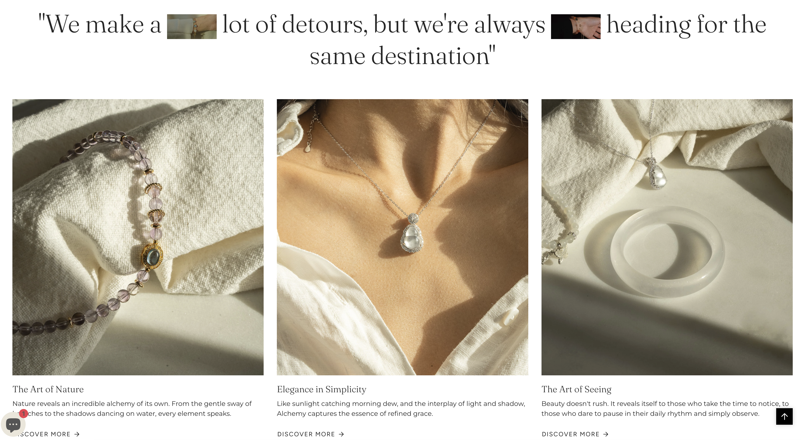
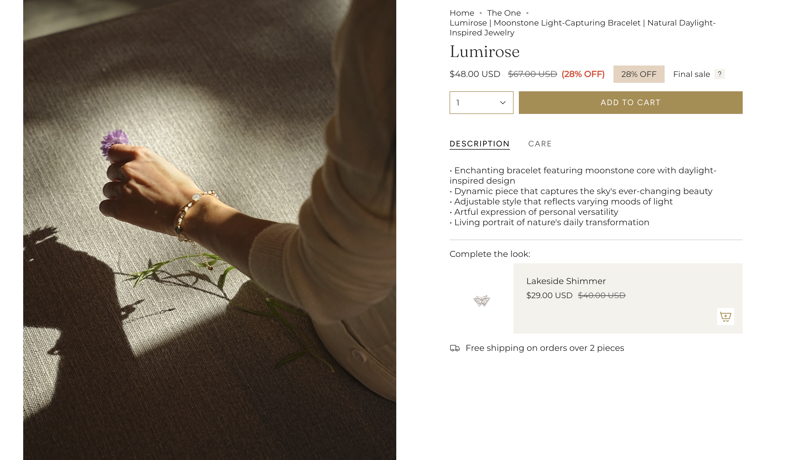

E-Commerce: Marketing & Content Creation Portfolio

**Live store:** [alchemy1916.com](https://alchemy1916.com/) — *the natural crystal beauty designed for daily luxury*

## Creative Direction



## Project Introduction

This repository showcases **Alchemy**, an e-commerce website designed to highlight my marketing abilities—specifically **content creation, product photography, and visual editing** for marketing campaigns. This project serves as a portfolio piece for my application as a **Marketing Data Analyst**, demonstrating that I not only understand how to analyze marketing data but also how to create the high-quality assets that drive those campaigns.

All visual materials (pictures and videos) featured on this platform were shot by me using a **Sony a7 IV** and professionally edited in **Adobe Photoshop**. Beyond asset creation, this project also tracks key e-commerce metrics (session stats, customer acquisition) to measure the real-world impact of the creative direction.

## Tools and Technologies Used

| Category | Tools and Technologies |
| --- | --- |
| **Camera Equipment** | **Sony a7 Mark IV** — High-resolution product photography and campaign videography |
| **Editing & Design** | **Adobe Photoshop** — Color grading, retouching, composition, and graphic design |
| **Content Strategy** | Visual storytelling, brand identity development, and conversion-focused asset creation |
| **Web Presentation** | Storefront shows brand aesthetic, I learnt from Aesop and focus on relaxing online shopping experience |

## Skill Highlights

- **Product Photography (Sony a7 IV)** — Lighting, composition, and brand-focused product shoots.
- **Photo & Asset Editing (Adobe Photoshop)** — Retouching, color correction, and assets for web and social.
- **Marketing Data Analysis** — Session stats, customer acquisition, and performance tracking.
- **Campaign Content Creation** — Cohesive visual identity and brand storytelling across the store.

## Creative Highlights

**Asset Transformation — Raw to Retouched** (Adobe Photoshop)

```text
The editing process focused on enhancing product details, ensuring color accuracy, and applying a consistent mood that aligns with the "Alchemy" brand identity. Backgrounds were cleaned, shadows adjusted, and contrast optimized for web viewing.
```


**Campaign Visuals — Lifestyle & Product Integration** (Sony a7 IV)

```text
Shot with the Sony a7 IV, utilizing its advanced autofocus and dynamic range to capture crisp product details even in complex lighting scenarios. The goal was to create "lifestyle" imagery that helps customers visualize the product in their own lives.
```



## Email Marketing

Newsletter and promotional emails designed to match the Alchemy brand—driving repeat visits and conversions with on-brand visuals and copy.


## Store Performance & Analytics

Creating beautiful assets is only half the job—the other half is measuring their impact. Below is a snapshot of the e-commerce store's performance metrics, driven by the visual marketing campaigns:

* **Total User Sessions:** [Insert Number, e.g., 15,240] sessions over the campaign period, indicating strong top-of-funnel traffic generation from marketing assets.
* **New Customer Acquisition:** [Insert Number, e.g., 1,450] unique customers acquired, demonstrating that the visual content successfully converted visitors into buyers.
* **Engagement Rate:** [Insert Percentage, e.g., 4.2%] conversion/engagement rate, highlighting the effectiveness of the product photography and lifestyle imagery in driving user action.

**Session stats**


**Customer acquisition**


## Executive Summary

This project is a case study in visual marketing, content production, and performance analysis for the Alchemy brand. High-quality assets (Sony a7 IV + Adobe Photoshop) were created for engagement, and session/customer metrics were used to validate the creative strategy.

**Takeaways:**

1. **End-to-end execution** — Owned the process from shoot to post-production and web.
2. **Data-driven** — Combined creative production with store analytics to measure ROI.
3. **Photography & editing** — Sony a7 IV and Photoshop for commercial-ready assets.
4. **Marketing synergy** — Creative content + analytical mindset; what looks good and what performs.

---
